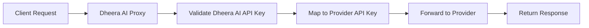

# Why Pass-Through Endpoints?

These endpoints are useful for 2 scenarios:

1. **Migrate existing projects** to dheera_ai proxy. E.g: If you have users already in production with Anthropic's SDK, you just need to change the base url to get cost tracking/logging/budgets/etc. 

2. **Use provider-specific endpoints** E.g: If you want to use [Vertex AI's token counting endpoint](https://docs.dheera_ai.ai/docs/pass_through/vertex_ai#count-tokens-api)

## How is your request handled? 

The request is passed through to the provider's endpoint. The response is then passed back to the client. **No translation is done.**

### Request Forwarding Process

1. **Request Reception**: Dheera AI receives your request at `/provider/endpoint`
2. **Authentication**: Your Dheera AI API key is validated and mapped to the provider's API key
3. **Request Transformation**: Request is reformatted for the target provider's API
4. **Forwarding**: Request is sent to the actual provider endpoint
5. **Response Handling**: Provider response is returned directly to you

### Authentication Flow

**Key Points:**
- Use your **Dheera AI API key** in requests, not the provider's key
- Dheera AI handles the provider authentication internally
- Same authentication works across all passthrough endpoints

### Error Handling

**Provider Errors**: Forwarded directly to you with original error codes and messages

**Dheera AI Errors**: 
- `401`: Invalid Dheera AI API key
- `404`: Provider or endpoint not supported
- `500`: Internal routing/forwarding errors

### Benefits

- **Unified Authentication**: One API key for all providers
- **Centralized Logging**: All requests logged through Dheera AI
- **Cost Tracking**: Usage tracked across all endpoints
- **Access Control**: Same permissions apply to passthrough endpoints
